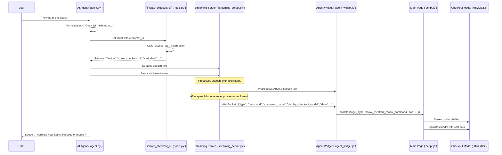

# Feature Documentation: Checkout Review Modal (Phase 1)

## 1. Feature Overview

This document details the implementation of the initial phase of the customer checkout process. When a user indicates to the AI agent their intent to checkout, this feature displays a modal window on the main e-commerce webpage. This modal presents the current contents of the user's shopping cart for review, including item names, quantities, and prices, along with a subtotal. The agent then verbally asks the user if they wish to proceed with the displayed items or modify their cart.

A key design consideration was ensuring the modal's appearance does not interrupt the agent's speech.

## 2. Core Requirements Addressed

*   **User-Initiated Checkout:** The process starts when the user tells the agent they want to checkout.
*   **UI Display:** A modal window appears centrally on the screen.
*   **Cart Content Display:** The modal shows current cart items, quantities, prices, and subtotal.
*   **Agent Interaction:** The agent prompts the user to confirm or modify the cart after the modal is shown.
*   **Non-Interruptive UI:** The system is designed so that the agent completes its relevant speech utterance *before* the UI modal command is fully processed and the modal appears.
*   **Modular Code:** Changes are integrated into the existing architecture, leveraging established communication patterns.

## 3. Architectural Flow & Pipeline

The display of the checkout review modal follows this sequence:

1.  **User Intent:** The user expresses their desire to checkout to the AI agent.
2.  **Agent Processing (Agent Side - `agent.py`, `prompts.py`):**
    *   The agent, guided by its prompts, recognizes the checkout intent.
    *   It formulates an initial verbal acknowledgment (e.g., "Okay, let me bring up your cart details.").
    *   It then calls the new `initiate_checkout_ui` tool, passing the `customer_id`.
3.  **Tool Execution (`tools.py`):**
    *   The `initiate_checkout_ui` tool internally calls `access_cart_information(customer_id)` to fetch the current cart data from the backend API.
    *   It returns a structured dictionary: `{"action": "show_checkout_ui", "cart_data": <fetched_cart_details>}`.
4.  **Streaming Server Orchestration (`streaming_server.py`):**
    *   The ADK runner sends events to `streaming_server.py`, including the agent's speech and the `tool_result` from `initiate_checkout_ui`.
    *   The `streaming_server.py` streams the agent's speech to the client (`agent_widget.js`).
    *   Upon receiving the `tool_result` containing `{"action": "show_checkout_ui", ...}`:
        *   It ensures any remaining speech segments for that specific agent utterance are sent first.
        *   *After* the relevant speech is streamed, it sends a WebSocket command to `agent_widget.js`: `{"type": "command", "command_name": "display_checkout_modal", "data": <cart_details>}`.
5.  **Agent Widget Relay (`agent_widget.js`):**
    *   The agent widget receives the `display_checkout_modal` command via WebSocket.
    *   It then uses `window.parent.postMessage({ type: 'show_checkout_modal_command', cart: <cart_details> }, '*')` to send the command and cart data to the main parent page (`script.js`). This leverages the existing secure iframe-to-parent communication channel.
6.  **Main Page UI Display (`script.js`, `index.html`, `style.css`):**
    *   `script.js` on the main page listens for the `show_checkout_modal_command` message.
    *   Upon receiving it, it calls a function (`openCheckoutReviewModal`) that:
        *   Makes the pre-defined checkout modal HTML (`#checkout-review-modal` in `index.html`) visible.
        *   Populates the modal with the cart items and subtotal received in the message (`populateCheckoutModal` function).
    *   The modal has "Modify Cart" and "Proceed (Next Step)" buttons. In this initial phase, both buttons will simply close the modal.
7.  **Agent Follow-up:** The agent, as per its updated prompts, then asks the user to confirm the cart or request modifications.



## 4. Component-Level Changes

### a. `agents/customer-service/customer_service/tools/tools.py`
*   **New Tool `initiate_checkout_ui(customer_id: str) -> dict`:**
    *   **Purpose:** To fetch cart information and signal the intent to display the checkout UI.
    *   **Arguments:** Takes `customer_id` (string).
    *   **Logic:**
        1.  Logs the initiation for the given `customer_id`.
        2.  Calls the existing `access_cart_information(customer_id=customer_id)` function to retrieve the current cart data. This function already handles API calls and error cases, returning a dictionary (potentially with an error field).
        3.  Constructs an `action_payload` dictionary: `{"action": "show_checkout_ui", "cart_data": cart_data}`.
        4.  Logs this payload.
        5.  Returns the `action_payload`.
    *   **Docstring and Type Hinting:** Added for clarity and maintainability.

### b. `agents/customer-service/customer_service/agent.py`
*   **Import:** The new `initiate_checkout_ui` function is imported from `.tools.tools`.
*   **Tool Registration:** `initiate_checkout_ui` is added to the `tools` list within the `Agent` constructor, making it available for the agent to use.
    ```python
    from .tools.tools import (
        # ... other tools
        initiate_checkout_ui, # Added for checkout UI
    )
    # ...
    root_agent = Agent(
        # ... other agent params
        tools=[
            # ... other tools
            initiate_checkout_ui, # Added for checkout UI
        ],
        # ... other callbacks
    )
    ```

### c. `agents/customer-service/customer_service/prompts.py`
*   **Order Management Section Update:**
    *   A new sub-section "Checkout Process Initiation" was added.
    *   Instructions for the agent:
        *   If the user expresses checkout intent, it MUST use the `initiate_checkout_ui` tool, passing the `customer_id`.
        *   Specifies the preceding acknowledgment speech: "Okay, I can help you with that. Let me bring up your cart details for you to review."
        *   Specifies the follow-up speech after the tool call (and UI appearance): "Here are the items currently in your cart. Would you like to proceed with these, or do you need to make any changes?"
    *   The previous instruction to handle checkout purely verbally and *not* display UI was removed.
*   **Tool List Update:**
    *   `initiate_checkout_ui(customer_id: str) -> dict` was added to the list of available tools with a description of its function.

### d. `agents/customer-service/streaming_server.py`
*   **Modification in `agent_to_client_messaging` function:**
    *   Inside the `async for agent_event in events_iter:` loop, after checking for status messages and other specific actions (like `set_theme`, `refresh_cart`, `product_recommendations`), a new condition was added to handle the `show_checkout_ui` action.
    *   This condition checks if `server_content.parts[0].function_response.response` (which is the dictionary returned by the tool) has an `"action"` key equal to `"show_checkout_ui"`.
        ```python
        # Inside the block checking tool_response_dict
        if tool_response_dict.get("action") == "show_checkout_ui":
            cart_data = tool_response_dict.get("cart_data")
            if cart_data is not None:
                logger.info(f"[DIAG_LOG S2C {session_id}] Handling 'show_checkout_ui'. Cart data present.")
                await ws.send_json({
                    "type": "command",
                    "command_name": "display_checkout_modal",
                    "data": cart_data
                })
                logger.info(f"[DIAG_LOG S2C {session_id}] Sent 'display_checkout_modal' command with cart data.")
                continue # Command handled
            else:
                logger.warning(f"[DIAG_LOG S2C {session_id}] 'show_checkout_ui' action received, but 'cart_data' is missing...")
                continue
        ```
    *   **Timing Rationale:** This block is placed where `tool_response_dict` is already confirmed to be a dictionary from a function response. The `continue` ensures that once this command is sent, the server moves to the next `agent_event`. The agent's speech parts are typically processed as separate events (often `text_delta` within `Part` objects) before or interleaved with tool call/result events. The design relies on the ADK event stream sending speech parts, then the tool result that triggers this UI command.

### e. `cymbal_home_garden_backend/static/agent_widget.js`
*   **Modification in `websocket.onmessage` handler:**
    *   A new `else if` condition was added to specifically check for the `display_checkout_modal` command:
        ```javascript
        // Inside websocket.onmessage, after other command checks
        if (parsedData.type === "command" && parsedData.command_name === "display_checkout_modal") {
            console.log(`[AgentWidgetDebug] websocket.onmessage: Received 'display_checkout_modal'. Payload:`, parsedData.data);
            if (parsedData.data) { // cart_data is expected in parsedData.data
                window.parent.postMessage({
                    type: 'show_checkout_modal_command',
                    cart: parsedData.data // Pass the cart data
                }, 'http://localhost:5000');
            } else {
                console.warn("[AgentWidgetDebug] websocket.onmessage: 'display_checkout_modal' command received but 'data' (cart_data) is missing.");
            }
            currentAgentMessageElement = null; // Reset current message element
            return; // Command handled
        }
        ```
    *   This code receives the command from `streaming_server.py` and uses `window.parent.postMessage` to relay it along with the `cart` data to `script.js` on the main page.

### f. `cymbal_home_garden_backend/templates/index.html`
*   **New HTML Structure for Checkout Modal:**
    *   A new `div` with `id="checkout-review-modal"` and class `checkout-modal` was added before the `<footer>` tag.
    *   This modal is initially hidden (`style="display:none;"`).
    *   **Structure:**
        *   `.checkout-modal-content`: Main container for modal content.
        *   `.checkout-modal-close-btn`: A span (`&times;`) to close the modal.
        *   `h2`: Title "Review Your Cart".
        *   `#checkout-modal-items-container`: A `div` where cart items will be dynamically inserted by JavaScript. Initially contains a "Loading cart..." paragraph.
        *   `.checkout-modal-summary`: Contains a paragraph for the subtotal (`#checkout-modal-subtotal`).
        *   `.checkout-modal-actions`: Contains two buttons:
            *   `#checkout-modal-modify-btn`: "Modify Cart"
            *   `#checkout-modal-proceed-btn`: "Proceed (Next Step)"

### g. `cymbal_home_garden_backend/static/style.css`
*   **New CSS Rules for Checkout Modal:**
    *   `.checkout-modal`: Styles for the modal overlay (fixed position, full screen, background, z-index, display flex for centering).
    *   `.checkout-modal-content`: Styles for the modal box itself (background, margin, padding, border, border-radius, width, max-width, shadow, position relative, animation).
    *   `.checkout-modal-close-btn`: Styles for the close button (position, appearance).
    *   `#checkout-modal-items-container`: Styles for the scrollable area for cart items (max-height, overflow-y, borders, padding).
    *   `.checkout-modal-item`: Styles for individual cart items within the modal (flex display, padding, border, font size).
        *   `.checkout-modal-item-name`, `.checkout-modal-item-qty`, `.checkout-modal-item-price`: Styles for item details.
    *   `.checkout-modal-summary`: Styles for the subtotal section.
    *   `.checkout-modal-actions`: Styles for the button container (flex display, alignment, gap).
    *   `#checkout-modal-modify-btn`, `#checkout-modal-proceed-btn`: Styles for the action buttons, leveraging existing theme variables for consistency.

### h. `cymbal_home_garden_backend/static/script.js`
*   **DOM Element Selection:** Added selectors for the new checkout modal elements:
    *   `checkoutReviewModal`, `closeCheckoutReviewModalBtn`, `checkoutModalItemsContainer`, `checkoutModalSubtotalEl`, `checkoutModalModifyBtn`, `checkoutModalProceedBtn`.
*   **Message Listener (`window.addEventListener('message', ...)`):**
    *   Added an `else if` condition to handle messages with `event.data.type === 'show_checkout_modal_command'`.
    *   If this message type is received and `event.data.cart` exists, it calls `openCheckoutReviewModal(event.data.cart)`.
*   **New Functions:**
    *   `populateCheckoutModal(cartData)`:
        *   Takes `cartData` as input.
        *   Clears any existing content in `#checkout-modal-items-container`.
        *   If `cartData` or `cartData.items` is empty, displays "Your cart is currently empty." and disables the proceed button.
        *   Otherwise, iterates through `cartData.items`, creating a `div.checkout-modal-item` for each.
        *   Each item `div` displays the item's name (or product ID), quantity, and total price (price_per_unit * quantity).
        *   Updates the `#checkout-modal-subtotal` span with `cartData.subtotal`.
        *   Enables the proceed button.
    *   `openCheckoutReviewModal(cartData)`:
        *   Calls `populateCheckoutModal(cartData)`.
        *   Sets `checkoutReviewModal.style.display = 'flex'` (or `'block'`) to show the modal.
    *   `closeCheckoutReviewModal()`:
        *   Sets `checkoutReviewModal.style.display = 'none'` to hide the modal.
*   **Event Listeners for Modal Buttons:**
    *   `closeCheckoutReviewModalBtn`: Calls `closeCheckoutReviewModal` on click.
    *   `checkoutModalModifyBtn`: Logs a message and calls `closeCheckoutReviewModal` on click.
    *   `checkoutModalProceedBtn`: Logs a message, shows an alert ("Proceeding... not yet implemented"), and calls `closeCheckoutReviewModal` on click.

## 5. Key Logic and Rationale

*   **Non-Interruptive UI Display:** The primary strategy is to have `streaming_server.py` send the WebSocket command to trigger the UI *after* the agent's relevant speech for that turn has been streamed. This relies on the sequential processing of ADK events (speech parts, tool results) by the server.
*   **Leveraging Existing Patterns:** The communication from `agent_widget.js` to `script.js` uses the `window.parent.postMessage` method, which is already established and working for features like theme changes and cart refresh.
*   **Modularity:** The new UI is a distinct modal, and the agent logic is encapsulated in a new tool and specific prompt additions, minimizing impact on unrelated functionalities.
*   **Error Handling in Tools:** The underlying `access_cart_information` tool already has error handling for API calls, which the new `initiate_checkout_ui` tool benefits from. The `populateCheckoutModal` function also handles cases where cart data might be empty or missing.

## 6. How to Test (Conceptual)

1.  Ensure all services are running (Flask backend, ADK agent server, Node.js proxy).
2.  Open the Cymbal Home Garden website in a browser.
3.  Open the agent widget.
4.  Add some items to the cart using the main website UI or by asking the agent.
5.  Tell the agent: "I want to checkout" or "Let's proceed to payment."
6.  **Observe:**
    *   The agent should verbally acknowledge your request (e.g., "Okay, let me bring up your cart...").
    *   *After* this speech, the checkout review modal should appear.
    *   The modal should display the items currently in your cart with correct quantities, prices, and the subtotal.
    *   The agent should then verbally ask if you want to proceed or modify the cart.
7.  Click the "Modify Cart" button on the modal. The modal should close.
8.  Click the "Proceed (Next Step)" button. The modal should close, and an alert might appear indicating the next step is not yet implemented.
9.  Click the "X" (close) button on the modal. The modal should close.

## 7. Future Considerations/Next Steps (Beyond This Phase)

*   Implement the actual "Proceed" functionality (e.g., moving to shipping/payment steps).
*   Allow modifications to the cart directly from the modal or enhance agent interaction for modifications after the modal is shown.
*   More sophisticated state management for the checkout process.
*   Detailed error display within the modal if cart data fetching fails.

This documentation provides a comprehensive overview of the implemented feature.
