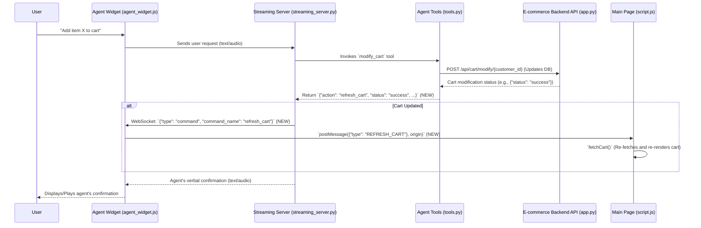

# Plan: Agent Cart Updates Not Reflected in UI

**Date:** 2025-05-16

**Objective:** Implement a mechanism for agent-initiated cart changes to be visually reflected on the website's cart display in real-time.

## 1. Problem Analysis & System Review:

*   **Hypothesized Reasons for Discrepancy:**
    *   The core issue is a missing communication link: The agent backend (ADK tools, streaming server) modifies the cart state in the database via API calls, but there's no mechanism to signal the frontend (main website `script.js`) to re-fetch and re-render the cart display after these agent-initiated changes.
    *   The frontend only refreshes its cart display upon user interactions within the main page (e.g., clicking "Add to Cart" on the product page itself), not when the agent performs an action.

*   **Existing Agent Cart Tools ([`agents/customer-service/customer_service/tools/tools.py`](../agents/customer-service/customer_service/tools/tools.py:0)):**
    *   `access_cart_information(customer_id)`: Fetches cart data.
    *   `modify_cart(customer_id, items_to_add, items_to_remove)`: Calls the backend API (`/api/cart/modify/{customer_id}`) to update the cart. This tool successfully updates the backend/database state. However, its return value (e.g., `{'status': 'success', ...}`) is a simple status dictionary and does **not** include any special "action" field (like `{"action": "refresh_cart"}`) that the streaming server might recognize to trigger a frontend update.

*   **Frontend Cart Logic ([`cymbal_home_garden_backend/static/script.js`](../cymbal_home_garden_backend/static/script.js:0)):**
    *   `fetchCart()`: Fetches cart data from `/api/cart/{DEFAULT_CUSTOMER_ID}` and updates the UI.
    *   User-initiated cart actions (e.g., `addToCart`, `removeProductFromCart`) call `fetchCart()` after their API operations to refresh the UI.
    *   A `window.addEventListener('message', ...)` exists to listen for messages from the embedded `agent_widget.js`. It currently only handles messages with `type: "SET_WEBSITE_THEME"`. There's no handler for a cart refresh message.

*   **Agent-to-Frontend Communication Mechanism:**
    *   The system **does** have a pattern for agent-to-frontend communication, as seen with the `set_website_theme` tool. This is documented in [`memory-bank/systemPatterns.md`](systemPatterns.md:115) and implemented as follows:
        1.  Agent tool (`set_website_theme` in `tools.py`) returns a dictionary like `{"action": "set_theme", "theme": "night"}`.
        2.  The `streaming_server.py` (specifically `agent_to_client_messaging` function) detects this "action" in the tool's response.
        3.  `streaming_server.py` sends a WebSocket message to `agent_widget.js` like `{"type": "command", "command_name": "set_theme", "payload": {"theme": "night"}}`.
        4.  `agent_widget.js` (in its `websocket.onmessage` handler) receives this and uses `window.parent.postMessage({"type": "SET_WEBSITE_THEME", "payload": "night"}, 'http://localhost:5000')` to notify the main page.
        5.  The main page's `script.js` (in its `window.addEventListener('message', ...)` handler) receives this message and calls `applyTheme()`.
    *   This existing `set_website_theme` pattern is the ideal model to follow for implementing cart refresh notifications. The discrepancy arises because the cart tools do not currently leverage this pattern.

## 2. Debugging and Implementation Plan:

The goal is to implement a similar communication flow for cart updates as exists for theme changes.

*   **Step-by-Step Plan:**

    1.  **Modify Agent Tool (`modify_cart` in [`agents/customer-service/customer_service/tools/tools.py`](../agents/customer-service/customer_service/tools/tools.py:0)):**
        *   **Change:** Update the `modify_cart` function (and potentially `add_to_cart`, `remove_from_cart` if they are separate and used directly, though `modify_cart` seems to be the primary one) to include an `"action": "refresh_cart"` field in its return dictionary *in addition* to the existing status information.
        *   **Example Return:** `{"action": "refresh_cart", "status": "success", "message": "Cart updated successfully.", "items_added": true, "items_removed": false}`
        *   **File to Inspect/Modify:** [`agents/customer-service/customer_service/tools/tools.py`](../agents/customer-service/customer_service/tools/tools.py:166)

    2.  **Update Streaming Server ([`agents/customer-service/streaming_server.py`](../agents/customer-service/streaming_server.py:0)):**
        *   **Change:** In the `agent_to_client_messaging` function, add logic to detect the `{"action": "refresh_cart"}` in the tool's response, similar to how it detects `{"action": "set_theme"}`.
        *   When detected, send a new WebSocket command to the `agent_widget.js`.
        *   **Example WebSocket Message:** `{"type": "command", "command_name": "refresh_cart"}` (payload might not be needed if it's just a trigger).
        *   **File to Inspect/Modify:** [`agents/customer-service/streaming_server.py`](../agents/customer-service/streaming_server.py:188) (specifically around line 220 where theme action is handled).

    3.  **Update Agent Widget ([`cymbal_home_garden_backend/static/agent_widget.js`](../cymbal_home_garden_backend/static/agent_widget.js:0)):**
        *   **Change:** In the `websocket.onmessage` handler, add a new `else if` condition to listen for the `{"type": "command", "command_name": "refresh_cart"}` message from the streaming server.
        *   When this message is received, use `window.parent.postMessage` to send a message to the main page (`script.js`).
        *   **Example `postMessage`:** `window.parent.postMessage({"type": "REFRESH_CART"}, 'http://localhost:5000');`
        *   **File to Inspect/Modify:** [`cymbal_home_garden_backend/static/agent_widget.js`](../cymbal_home_garden_backend/static/agent_widget.js:175) (add a new condition similar to the `set_theme` handling).

    4.  **Update Main Page Script ([`cymbal_home_garden_backend/static/script.js`](../cymbal_home_garden_backend/static/script.js:0)):**
        *   **Change:** In the `window.addEventListener('message', ...)` handler, add a new `else if` condition to listen for the `{"type": "REFRESH_CART"}` message from the agent widget.
        *   When this message is received, call the existing `fetchCart()` function to re-fetch cart data from the backend and re-render the cart display.
        *   **File to Inspect/Modify:** [`cymbal_home_garden_backend/static/script.js`](../cymbal_home_garden_backend/static/script.js:415) (add a new condition after the `SET_WEBSITE_THEME` handling).

*   **Logging (Recommended):**
    *   **Backend (`tools.py`):** Log the modified return value of `modify_cart` to confirm `{"action": "refresh_cart"}` is included.
    *   **Streaming Server (`streaming_server.py`):** Log when it detects the `refresh_cart` action and when it sends the corresponding WebSocket command to the widget.
    *   **Agent Widget (`agent_widget.js`):** Log when it receives the `refresh_cart` WebSocket command and when it `postMessage`s to the parent.
    *   **Main Page (`script.js`):** Log when it receives the `REFRESH_CART` message from the widget and when it calls `fetchCart()`.