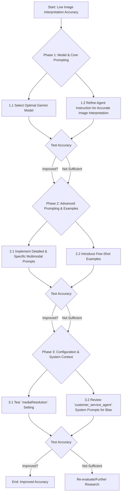

# Plan to Improve Multimodal Agent Image Interpretation Accuracy

**I. Foundational Understanding & Goal:**
The core problem is the low accuracy of the multimodal agent's image interpretation, despite the technical pipeline for data transmission being functional. The goal is to significantly improve this accuracy by leveraging ADK features and general multimodal AI best practices.

**II. Research Findings Summary:**

1.  **ADK & Gemini Models:**
    *   ADK is optimized for Gemini models. The `LlmAgent` (aliased as `Agent`) is the primary class for interacting with these models.
    *   Several Gemini models support multimodal inputs (image, audio, video, text), including:
        *   `gemini-2.5-pro-preview-05-06` (or latest "Pro" version): Explicitly "best for multimodal understanding." **This is the top recommendation.**
        *   `gemini-2.0-flash` / `gemini-1.5-flash` / `gemini-1.5-pro`: Also support multimodal inputs.
    *   The "Live API" (e.g., `gemini-2.0-flash-live-001`) is more focused on low-latency voice/video streaming interactions rather than optimizing still image analysis accuracy for non-streaming cases.
    *   **[MEMORIZE]** Source: Google AI for Developers - Gemini Models (`https://ai.google.dev/gemini-api/docs/models`) & ADK Model Docs (`https://google.github.io/adk-docs/agents/models/`).

2.  **ADK `LlmAgent` Configuration for Multimodal Input:**
    *   **`model` (str|BaseLlm):** Specifies the Gemini model to use.
    *   **`instruction` (str|InstructionProvider):** The primary system prompt for the agent. Crucial for guiding interpretation.
    *   **`global_instruction` (str|InstructionProvider):** Root-level instruction, can influence overall agent persona/behavior.
    *   **`examples` (Optional[list[Example]]):** Allows providing few-shot examples. `Example` objects contain `input` (Content) and `output` (list[Content]), enabling multimodal (image-text) examples.
    *   **`generate_content_config` (Optional[types.GenerateContentConfig]):**
        *   Can include `systemInstruction`.
        *   Contains `mediaResolution` (enum: LOW, MEDIUM, HIGH). Its effect on *input* image quality/detail for the model is unconfirmed but worth testing (`HIGH`).
    *   **Input Structure:** Multimodal inputs are passed as `Content` objects containing `Part` objects. Images are typically `Part`s with `inlineData` (bytes) and a `mimeType` (e.g., `image/jpeg`).
    *   **[MEMORIZE]** Source: ADK API Reference (`https://google.github.io/adk-docs/api-reference/google-adk.html#google.adk.agents.LlmAgent`).

3.  **ADK Documentation Gaps for Vision Accuracy:**
    *   No explicit ADK configuration parameters were found to *directly* fine-tune vision model behavior (e.g., "focus on objects," "prioritize text in image") beyond general prompting and model selection.
    *   The impact of `mediaResolution` on input image processing by the model is not explicitly detailed.

4.  **General Multimodal Prompting Best Practices:**
    *   Detailed textual descriptions accompanying the image.
    *   Instructing the model to reason step-by-step about the image.
    *   Role-playing prompts (e.g., "You are an expert image analyst...").
    *   Asking specific questions about image content/features.
    *   Chain-of-thought or similar structured prompting for visual analysis.

**III. Proposed Plan to Improve Image Interpretation Accuracy:**

The plan will focus on iterative changes and testing, starting with the most impactful and ADK-native solutions.

**Phase 1: Model Selection & Core Prompting**

1.  **Action 1.1: Select Optimal Gemini Model**
    *   **Change:** Modify the `customer_service_agent` configuration to use the latest recommended "Pro" version of Gemini known for strong multimodal understanding.
    *   **Recommendation:** `gemini-2.5-pro-preview-05-06` (or the latest equivalent available at the time of implementation).
    *   **Rationale:** "Pro" models are generally more capable for complex reasoning, including nuanced visual interpretation.
    *   **ADK Parameter:** `LlmAgent(model="gemini-2.5-pro-preview-05-06")`.

2.  **Action 1.2: Refine Agent `instruction` (System Prompt) for Accurate Image Interpretation**
    *   **Change:** **Critically review and enhance** the main `instruction` (system prompt) for the `customer_service_agent` to explicitly guide its visual analysis towards higher accuracy. This involves instructing the model on how to approach image understanding tasks.
    *   **Examples of Refinements:**
        *   "You are an AI assistant highly skilled in detailed and accurate image analysis. When an image is provided, your primary goal is to meticulously examine all visual aspects to correctly understand its content, identify objects, discern context, and interpret any text present. Base your answers on a comprehensive and objective interpretation of the visual information."
        *   If the agent has a primary domain (e.g., gardening), add: "While your primary expertise is [domain], when an image is provided, you must prioritize objective and accurate interpretation of all visual content, even if it falls outside your typical domain. Do not let your [domain] knowledge bias your visual analysis of unrelated images."
        *   "Focus on identifying the primary subject(s) first, then describe their attributes and actions. Note important background elements and the overall scene composition."
    *   **Rationale:** Clear, direct, and detailed instructions are fundamental to steering the model's behavior and improving the quality of its interpretations.
    *   **ADK Parameter:** `LlmAgent(instruction="...")`.

**Phase 2: Advanced Prompting Techniques & Few-Shot Examples (Client-Side & Agent Config)**

These changes would primarily be in how the multimodal query is constructed in `agent_widget.js` (for the text part of the prompt) and in the agent's configuration for examples.

1.  **Action 2.1: Implement Detailed & Specific Multimodal Prompts (Client-Side)**
    *   **Change:** Modify `agent_widget.js` to construct and send more descriptive, specific, and context-rich text prompts alongside each image. This is about improving the "question" or "task" given to the model for each image.
    *   **Techniques to Implement:**
        *   **Contextual Priming:** "The attached image shows [brief user description if available, e.g., 'a person in a room']. Please analyze it and answer the following: ..."
        *   **Targeted Questions:** Instead of a generic "What is this?", use focused questions like: "Describe the main subject in the image. What are they doing? What specific objects are immediately around them? What is the general setting?"
        *   **Request for Step-by-Step Reasoning:** "Analyze the provided image. Describe your step-by-step reasoning for identifying the main subject and its characteristics."
        *   **Role-Playing (Reinforced at Query Time):** "As an expert image analyst, examine this image and provide a detailed breakdown of its contents."
        *   **Negative Constraints (if applicable):** "Focus on identifying animate objects. Do not describe inanimate background details unless specifically asked." (Use with caution, as it can be too restrictive).
    *   **Rationale:** Richer, more specific textual context for each image query helps the model focus its analytical capabilities and better understand the user's intent for the image analysis task.

2.  **Action 2.2: Introduce Few-Shot Examples (Agent Configuration)**
    *   **Change:** Add relevant few-shot examples to the `customer_service_agent` configuration using the `examples` parameter of `LlmAgent`.
    *   **Content of Examples:** Each example should be a `types.Example` object containing:
        *   `input`: A `types.Content` object with two `Part`s:
            *   One `Part` for an image (`inlineData` with image bytes and `mimeType`).
            *   One `Part` for an accompanying text prompt related to that image.
        *   `output`: A `types.Content` object with a `Part` containing the desired accurate text interpretation/answer for that image-text pair.
    *   **Example Scenarios:** Include diverse images, especially those similar to ones currently being misinterpreted (e.g., a person vs. a plant).
    *   **Rationale:** Few-shot examples are highly effective in guiding model behavior and improving accuracy for specific tasks.
    *   **ADK Parameter:** `LlmAgent(examples=[example1, example2, ...])`.

**Phase 3: Configuration Tuning & System Context Review**

1.  **Action 3.1: Test `mediaResolution` Setting**
    *   **Change:** Experiment with setting `mediaResolution` to `MEDIA_RESOLUTION_HIGH` within the `generate_content_config` of the `LlmAgent`.
    *   **Rationale:** If this parameter influences input image processing, higher resolution could provide more detail to the model. This is speculative and needs testing.
    *   **ADK Parameter:** `LlmAgent(generate_content_config=types.GenerateContentConfig(media_resolution=types.MediaResolution.HIGH))`
    *   **Note:** The exact enum value `types.MediaResolution.HIGH` needs to be confirmed from the `google.genai.types` module if this path is pursued.

2.  **Action 3.2: Review `customer_service_agent` System Prompts for Bias**
    *   **Change:** If the `customer_service_agent` (or any parent/global agent configuration) has strong domain-specific system prompts (e.g., loaded from `agents/customer-service/customer_service/prompts.py` or defined in `agents/customer-service/customer_service/agent.py`), review and potentially neutralize or add clauses to ensure general images are not misinterpreted due to this bias.
    *   **Rationale:** An overly strong domain focus in system prompts might lead the model to "see" what it expects to see from its primary domain.

**IV. Iterative Testing Strategy:**

*   **Test Image Set:** Prepare a diverse set of test images, including:
    *   Images that were previously misinterpreted (e.g., person vs. plant).
    *   Images with clear, unambiguous subjects.
    *   Images with more complex scenes or multiple objects.
    *   Images containing text.
*   **Baseline:** Record the accuracy with the current setup.
*   **Incremental Changes:** Apply changes from each phase/action one at a time (or in small, logical groups) and test against the image set.
*   **Metrics:** Primarily qualitative assessment of interpretation accuracy. Quantitative metrics could be developed if specific, repeatable queries are used (e.g., "Is there a [object] in the image?").
*   **Documentation:** Keep a log of changes made and their impact on accuracy.

**V. Scope & Next Steps:**
This plan focuses on research-backed strategies for improving image interpretation accuracy within the ADK framework. The next step, after user approval of this plan, would be to switch to a suitable mode (e.g., "code" mode) to implement these changes, starting with Phase 1.