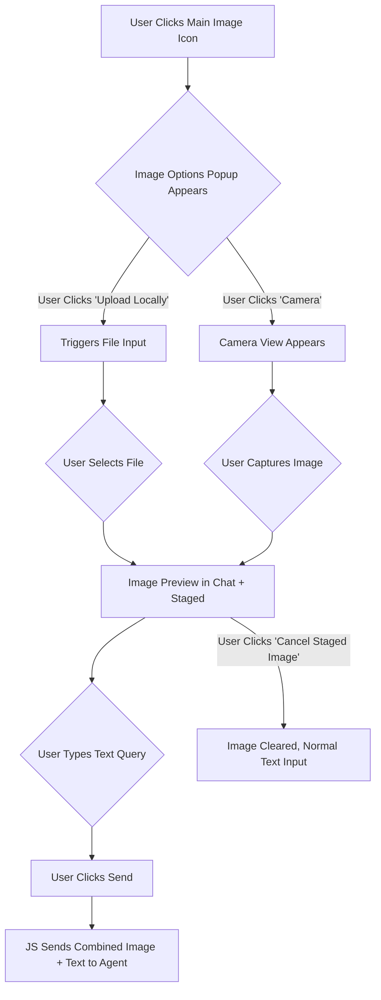

# Plan: Enhanced Image Analysis Feature for Agent Widget

## 1. Overall Goal
Modify the agent widget to allow users to click an image button, choose between camera capture or local upload, and then send the selected image along with a text query to the multimodal agent, as per the user's expected behavior.

## 2. Detailed Plan

### Phase 1: UI Changes
*   **Objective:** Modify the agent widget's UI to present "Camera" and "Upload Locally" options when the main image button is clicked.
*   **Actions:**
    1.  The main image icon in the widget footer (currently `div class="footer-icon upload-image-btn"`) will toggle a small popup/flyout menu.
    2.  This popup will contain two new, smaller buttons:
        *   "Camera" (e.g., `<button class="camera-btn"><i class="fa-solid fa-camera"></i> Camera</button>`)
        *   "Upload" (e.g., `<button class="upload-local-btn"><i class="fa-solid fa-upload"></i> Upload</button>`)
    3.  The "Upload" button will trigger the existing hidden file input (`<input type="file" id="imageUploadInput">`).
    4.  The "Camera" button will initiate the camera capture flow (Phase 2).
    5.  JavaScript logic will handle the visibility toggle of the popup and clicks on the new buttons.
*   **Relevant Files:**
    *   [`cymbal_home_garden_backend/templates/agent_widget.html`](cymbal_home_garden_backend/templates/agent_widget.html) (for new buttons and popup structure)
    *   [`cymbal_home_garden_backend/static/agent_widget.css`](cymbal_home_garden_backend/static/agent_widget.css) (for styling the popup and new buttons)
    *   [`cymbal_home_garden_backend/static/agent_widget.js`](cymbal_home_garden_backend/static/agent_widget.js) (for event handling and popup logic)

### Phase 2: Camera Capture Logic
*   **Objective:** Implement functionality to capture an image using the device's camera.
*   **Actions:**
    1.  On "Camera" button click, use `navigator.mediaDevices.getUserMedia({ video: true })` to request camera access.
    2.  Display the live camera stream (e.g., in a modal popup or an inline view within the widget). This will require adding a `<video>` element to `agent_widget.html`.
    3.  Provide a "Capture" button associated with the camera stream.
    4.  When "Capture" is clicked, draw the current video frame to a `<canvas>` element.
    5.  Convert the canvas content to a Data URL (e.g., `image/jpeg`).
    6.  The captured image data will then be "staged" for sending (see Phase 3).
    7.  Implement logic to stop the camera stream (`track.stop()`) after capture or if the user cancels.
*   **Relevant Files:**
    *   [`cymbal_home_garden_backend/static/agent_widget.js`](cymbal_home_garden_backend/static/agent_widget.js)
    *   [`cymbal_home_garden_backend/templates/agent_widget.html`](cymbal_home_garden_backend/templates/agent_widget.html) (for video element, canvas, capture button)
    *   [`cymbal_home_garden_backend/static/agent_widget.css`](cymbal_home_garden_backend/static/agent_widget.css) (for styling the camera view/modal)

### Phase 3: Combined Image and Text Query Logic
*   **Objective:** Allow the user to send an image (uploaded or captured) along with a related text query as a single multimodal input.
*   **Actions:**
    1.  **Image Staging:**
        *   When an image is selected (uploaded or captured), do not send it to the server immediately.
        *   Store the base64 image data and its MIME type in a temporary JavaScript variable (e.g., `stagedImage`).
        *   Display the image preview in the chat area.
        *   Add a visual indicator that an image is "staged" and awaiting a text query.
        *   Modify the chat input placeholder (e.g., "Ask a question about the image...").
    2.  **Sending Combined Input:**
        *   When the user types a message and sends (while an image is staged):
            *   Retrieve the text from the chat input.
            *   Construct a JSON payload containing both the staged image data (e.g., base64 string, MIME type) and the text query. The exact structure will be determined by ADK/multimodal model requirements (see Phase 5). Example structure:
                ```json
                {
                  "parts": [
                    { "mime_type": "image/jpeg", "data": "base64_image_data_here" },
                    { "mime_type": "text/plain", "data": "user_text_query_here" }
                  ]
                }
                ```
            *   Send this payload via WebSocket using the existing `sendMessageToServer` function.
            *   Clear the `stagedImage` variable.
            *   Reset the chat input placeholder.
    3.  **Text-Only Input:** If no image is staged, send text messages as currently implemented.
    4.  **Cancel Staged Image:** Provide a UI element (e.g., a small 'x' button on the preview) to allow the user to clear the `stagedImage` and revert to normal text input.
*   **Relevant Files:**
    *   [`cymbal_home_garden_backend/static/agent_widget.js`](cymbal_home_garden_backend/static/agent_widget.js)

### Phase 4: Backend/Agent Handling (Considerations)
*   **Objective:** Ensure the ADK agent can receive and process the combined image-text payload. (Note: Implementation of this is outside the scope of the architect's current task, but planning for it is essential).
*   **Considerations:**
    1.  The ADK agent's message handling logic (likely in `agents/customer-service/customer_service/agent.py` or related streaming files like `agents/customer-service/streaming_server.py`) will need to be updated to:
        *   Recognize the new multimodal payload structure (e.g., by checking for a specific top-level MIME type or the presence of `parts`).
        *   Extract the image data (and its MIME type) and the text query from the payload.
    2.  The agent must then pass both the image and text components to the configured multimodal model (e.g., Gemini) using the appropriate API calls for multimodal inference.

### Phase 5: ADK Documentation Review
*   **Objective:** Ensure the implementation aligns with ADK best practices for multimodal input.
*   **Actions:**
    1.  Throughout the development of Phases 2 and 3, consult the latest official Google Agent Development Kit (ADK) documentation.
    2.  Focus on:
        *   The recommended format for sending multimodal (image + text) queries to an ADK agent.
        *   How the ADK agent is expected to receive and parse such inputs.
        *   How the ADK agent should forward these inputs to a multimodal LLM (e.g., Gemini).
        *   Any client-side utilities or patterns provided by ADK for handling media capture or multimodal data transmission.
    3.  This review will inform the precise JSON structure used in Phase 3 and the expected handling in Phase 4.

## 3. UI Flow Diagram (Mermaid)



## 4. User's Original Description of Expected Behavior
"WHEN I CLICK ON THE IMAGE BUTTON IN THE WIDGET IT SHOULD POP OUT TWO OTHER SMALL BUTTONS ONE FORM CAMERA ,THE OTHER UPLOAD LOCALLY AND THEN AFTER I EITHER CHOSE AN IMAHE OR TOOK A PHONE I SHOULD BE ABLE TO ADD TEXT QUERY TO THE IMAGE LIKE ,I WANN BUY THIS PLANT THATS ON THE IMAGE ,PLEASE USES ADK DOCS IF THRERE IS A REFERNCE ON HOW TO DO THIS ,NOTE THAT THE CURRENT MODEL IS MULTIMODAL"