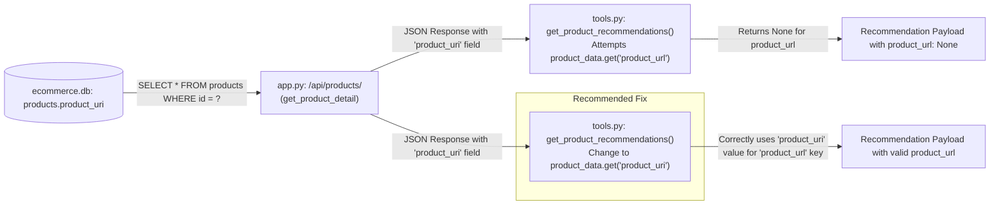

## Plan to Resolve Product Recommendation Card Link and Image Issues

### I. Introduction

This plan addresses two primary issues with the product recommendation cards:
1.  **`product_url` is `None`:** Product cards refresh the page on click because the `product_url` in the payload is `None`, leading to `href="#"` in the frontend.
2.  **`image_url` results in 404:** Product images are not displaying due to 404 errors (e.g., `GET /static/images/rosemary_arp.png HTTP/1.1" 404 -`).

### II. Plan to Fix `product_url`

**A. Analysis of Current State:**
*   The `product_url` for recommendation cards is sourced by the `get_product_recommendations` tool in [`agents/customer-service/customer_service/tools/tools.py`](agents/customer-service/customer_service/tools/tools.py:211).
*   This tool fetches product data from the `/api/products/<product_id>` endpoint in [`app.py`](app.py:0).
*   The [`get_product_detail`](app.py:124) function in [`app.py`](app.py:0) retrieves product data from the `ecommerce.db` database.
*   The database schema ([`database_setup.py`](database_setup.py:35)) defines a column `product_uri TEXT` intended to store the product's canonical URL.
*   Sample data in [`sample_data_importer.py`](sample_data_importer.py:0) populates `product_uri` with values like `"/products/SKU_PLANT_LAVENDER_001"`.
*   The API response from [`app.py`](app.py:0) includes the `product_uri` field as it is named in the database.

**B. Root Cause:**
The `get_product_recommendations` tool in [`agents/customer-service/customer_service/tools/tools.py`](agents/customer-service/customer_service/tools/tools.py:266) attempts to access `product_data.get("product_url")`. However, the data returned by the API (reflecting the database column name) contains `product_uri`. This mismatch causes `product_data.get("product_url")` to return `None`.



**C. Recommended Solution:**
Modify the `get_product_recommendations` function in [`agents/customer-service/customer_service/tools/tools.py`](agents/customer-service/customer_service/tools/tools.py:0) to use the correct field name from the API response.

1.  **File to Modify:** [`agents/customer-service/customer_service/tools/tools.py`](agents/customer-service/customer_service/tools/tools.py:0)
2.  **Function to Modify:** `get_product_recommendations`
3.  **Specific Change:**
    *   On line [266](agents/customer-service/customer_service/tools/tools.py:266), change:
        ```python
        "product_url": product_data.get("product_url")
        ```
        to:
        ```python
        "product_url": product_data.get("product_uri")
        ```

**D. Alternative (Less Recommended) Solution:**
This would involve renaming the `product_uri` column to `product_url` in the database schema ([`database_setup.py`](database_setup.py:0)) and updating all data entries in [`sample_data_importer.py`](sample_data_importer.py:0). This is more disruptive than the targeted fix in `tools.py`.

### III. Plan to Fix `image_url` (Address 404 Errors)

**A. Analysis of Current State:**
*   [`app.py`](app.py:14) configures Flask with `static_folder='cymbal_home_garden_backend/static'`. This means Flask serves files from the `c:/Users/Lenovo/OneDrive/Desktop/adk-samples/cymbal_home_garden_backend/static/` directory at the `/static` URL route.
*   [`sample_data_importer.py`](sample_data_importer.py:0) populates the `image_url` field in the database with paths like `"static/images/rosemary_arp.png"` (e.g., line [57](sample_data_importer.py:57)).
*   When the frontend requests an image using this path, the full URL becomes `http://<host>:<port>/static/images/rosemary_arp.png`.
*   The `get_product_recommendations` tool in [`tools.py`](agents/customer-service/customer_service/tools/tools.py:265) passes the `image_url` from the API response directly to the payload: ` "image_url": product_data.get("image_url")`.

**B. Likely Root Causes for 404 Errors:**
1.  **Missing Image Files:** The most probable cause is that the actual image files (e.g., `rosemary_arp.png`) are missing from the `c:/Users/Lenovo/OneDrive/Desktop/adk-samples/cymbal_home_garden_backend/static/images/` directory.
2.  **Incorrect `image_url` Path in Database:** For some specific products, the `image_url` value stored in the `ecommerce.db` might be incorrect or inconsistent with the `static/images/filename.ext` pattern established in [`sample_data_importer.py`](sample_data_importer.py:0).

**C. Recommended Verification and Correction Steps (Primarily Data/Environment Validation):**
1.  **Verify Physical Existence of Image Files:**
    *   Manually check that the image files (e.g., `rosemary_arp.png`) exist in the directory: `c:/Users/Lenovo/OneDrive/Desktop/adk-samples/cymbal_home_garden_backend/static/images/`.
    *   Ensure the Flask application has the necessary read permissions for this directory and its contents.
2.  **Verify Database `image_url` Values:**
    *   For any products consistently showing 404 errors for images, query the `ecommerce.db` to inspect their `image_url` column.
    *   Confirm these values are formatted correctly as `static/images/filename.ext`.
3.  **Ensure Data Consistency:**
    *   Review [`sample_data_importer.py`](sample_data_importer.py:0) to ensure all `image_url` entries follow the `static/images/filename.ext` pattern. If inconsistencies are found, correct them and re-populate the database.
4.  **No Code Change Anticipated if Data and Files are Correct:**
    *   If the image files exist in the correct location and the database paths are accurate (`static/images/filename.ext`), Flask's static file serving mechanism, as configured in [`app.py`](app.py:14), should correctly serve the images. No changes to `app.py` or `tools.py` for `image_url` path construction should be necessary.

### IV. Summary of Files to be Modified

*   **Primary Code Modification:**
    *   [`agents/customer-service/customer_service/tools/tools.py`](agents/customer-service/customer_service/tools/tools.py:0) (for `product_url` fix)
*   **Potential Data/Configuration Verifications/Corrections (No code changes if data is correct):**
    *   Image files within `cymbal_home_garden_backend/static/images/` (for `image_url` fix)
    *   Data within `ecommerce.db` (via [`sample_data_importer.py`](sample_data_importer.py:0) or direct check) (for both `product_url` and `image_url` if data is missing/incorrect)

### V. Next Steps
This plan will be passed to the Code mode for implementation of the recommended code change and to guide verification of data and file existence.