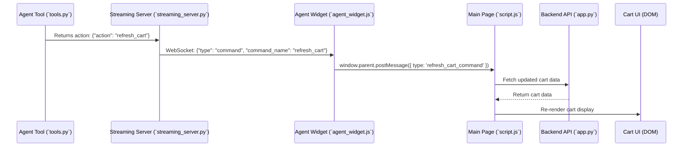

# System Patterns: Cymbal Home Garden Platform & Customer Service Agent

## 1. Overall Architecture
The system comprises three main parts: the E-commerce Platform, the Customer Service Agent system, and a Proxy Server to facilitate communication between the two when the agent widget is embedded in the e-commerce site.

```mermaid
graph TD
    subgraph E-commerce Platform (localhost:5000)
        direction LR
        UserInterface[User Frontend: index.html] --> API[Flask Backend: app.py]
        API -- CRUD --> DB[(SQLite: ecommerce.db)]
    end

    subgraph "Node.js Proxy Server (localhost:3000)"
        direction LR
        ProxyServer[Proxy: proxy-server.js]
    end

    subgraph "ADK Customer Service Agent System (localhost:8000)"
        direction LR
        ADK_HTTP_Endpoint[ADK HTTP Endpoint (for Sessions)]
        ADK_WS_Endpoint[ADK WebSocket Endpoint (for run_live)]
        ADK_HTTP_Endpoint -- Manages Sessions for --> CS_Agent[Customer Service ADK Agent]
        ADK_WS_Endpoint -- Streams Data for --> CS_Agent
        CS_Agent -- Uses --> GeminiModel[Gemini Live API Model]
        CS_Agent -- Accesses Tools --> EcommAPI_Tools(E-commerce API Tools)
        EcommAPI_Tools -- Calls --> API
    end

    UserInterface -- Embeds --> UserWidget[Agent Widget UI (agent_widget.html/js)]
    UserWidget -- HTTP for Session --> ProxyServer
    UserWidget -- WebSocket for Chat/Voice/Video --> ProxyServer
    ProxyServer -- Forwards HTTP to --> ADK_HTTP_Endpoint
    ProxyServer -- Forwards WebSocket to --> ADK_WS_Endpoint


    style DB fill:#DBF8A7,stroke:#333,stroke-width:2px
    style API fill:#A7D0F8,stroke:#333,stroke-width:2px
    style UserInterface fill:#F8A7D0,stroke:#333,stroke-width:2px
    
    style ProxyServer fill:#E8DAEF,stroke:#333,stroke-width:2px

    style UserWidget fill:#D2B4DE,stroke:#333,stroke-width:2px
    style ADK_HTTP_Endpoint fill:#A9CCE3,stroke:#333,stroke-width:2px
    style ADK_WS_Endpoint fill:#A9CCE3,stroke:#333,stroke-width:2px
    style CS_Agent fill:#AED6F1,stroke:#333,stroke-width:2px
    style GeminiModel fill:#A2D9CE,stroke:#333,stroke-width:2px
    style EcommAPI_Tools fill:#FAD7A0,stroke:#333,stroke-width:2px
```

## 2. E-commerce Platform Components and Interactions (localhost:5000)

### 2.1. SQLite Database (`ecommerce.db`)
*   **Role:** Primary data store for product information.
*   **Schema Management:** `database_setup.py`.
*   **Data Population:** `sample_data_importer.py`.

### 2.2. Flask Backend (`app.py`)
*   **Role:** Serves RESTful API for product data and the main e-commerce frontend (`index.html`).
*   **Frontend Hosting:** Serves `index.html` which embeds `agent_widget.html`.

### 2.3. Agent Widget UI (`cymbal_home_garden_backend/templates/agent_widget.html`, `cymbal_home_garden_backend/static/agent_widget.js`)
*   **Role:** Client-side interface for user interaction, embedded within `index.html`.
*   **Communication:**
    *   Makes an HTTP POST request to create a session via the Proxy Server.
    *   Establishes a WebSocket connection for chat/voice/video via the Proxy Server.

## 3. Node.js Proxy Server (`proxy-server.js`, localhost:3000)

*   **Role:** Mitigates CORS issues and forwards requests from the Agent Widget (running on `localhost:5000`) to the ADK Server (running on `localhost:8000`).
*   **Technology:** Node.js, Express, `cors`, native `http` module, `http-proxy-middleware`.
*   **HTTP Proxying (`/apps/**`):**
    *   Uses a **manual proxy implementation** (native `http` module) for ADK session creation requests. This was implemented to resolve issues where `http-proxy-middleware` was not correctly handling POST requests with empty bodies, leading to 405 errors.
    *   Ensures `Content-Length: 0` and appropriate headers are sent to the ADK server for session creation.
*   **WebSocket Proxying (`/run_live`):**
    *   Uses `http-proxy-middleware` to proxy WebSocket connections.
    *   Requires explicit handling of the main HTTP server's `upgrade` event to delegate to the middleware's `upgrade` function.
*   **CORS Handling:** Configured to dynamically allow origins `http://localhost:5000` and `http://127.0.0.1:5000`.

## 4. ADK Customer Service Agent System (localhost:8000)

### 4.1. ADK HTTP & WebSocket Endpoints (provided by `adk web`)
*   **Role:** Server-side endpoints for the ADK framework.
    *   **HTTP (`/apps/{app_name}/users/{user_id}/sessions`):** Used for creating agent sessions. Expects a POST request with `Content-Length: 0`.
    *   **WebSocket (`/run_live`):** Used for real-time communication (chat, voice, video) once a session is established.
*   **Technology:** Part of the Google ADK framework, served by the `adk web` command.

### 4.2. Customer Service ADK Agent (`agents/customer-service/customer_service/agent.py`)
*   **Role:** Core logic for customer interactions, tool usage, and LLM communication.
*   **Technology:** Google ADK, Python.
*   **Configuration:** Defined in `config.py`.

### 4.3. Gemini Live API Model
*   **Role:** The Large Language Model used by the ADK Agent.

### 4.4. E-commerce API Tools
*   **Role:** ADK tools allowing the agent to interact with the E-commerce Platform's Flask API.

## 5. Key Design Patterns & Decisions

### 5.1. Proxy Server Implementation
*   **Hybrid Approach:** Utilizes a manual HTTP proxy for problematic POST requests to ensure precise control over request formation, while leveraging `http-proxy-middleware` for its robust WebSocket proxying capabilities. This pragmatic approach was adopted after extensive debugging of 405 errors with `http-proxy-middleware` for specific HTTP requests.
*   **Explicit WebSocket Upgrade Handling:** Essential for `http-proxy-middleware` when integrating with an existing Express server.
*   **Dynamic CORS Origin:** Allows flexibility in accessing the development environment (localhost vs. 127.0.0.1).

### 5.2. Client-Side (Agent Widget)
*   **ADK Session Management:** HTTP POST to create a session *before* attempting WebSocket connection. Session ID is then passed as a query parameter in the WebSocket URL.
*   **Request Formatting:** Critical to match ADK server expectations for session creation (empty body, specific headers or lack thereof).

### 5.3. Debugging Strategy
*   **Iterative Logging:** Adding detailed logging at each step of the request lifecycle (client, proxy (global and specific middleware), target server) was crucial for pinpointing where requests were being altered or rejected.
*   **Isolation:** Testing components (e.g., ADK Dev UI direct vs. widget via proxy) helped identify discrepancies.
*   **Tool-Specific Behavior:** Recognizing that `http-proxy-middleware` might have its own behavior/defaults that can conflict with specific backend expectations, leading to the manual proxy solution for the problematic route.

### 5.4 Agent-to-Frontend Theme Control Communication

A specific communication pattern enables the agent to control the website's theme:

1.  **Agent Command:** Agent uses the `set_website_theme` tool.
2.  **Streaming Server (`streaming_server.py`):** Receives command, sends WebSocket message to the agent widget.
3.  **Agent Widget (`agent_widget.js`):** Receives WebSocket message, uses `window.parent.postMessage()` to send theme data to the main page (parent window).
4.  **Main Page (`script.js`):** Listens for the `message` event from the iframe, calls `applyTheme` to update UI and persist theme in `localStorage`.

This pattern facilitates real-time UI updates on the main page driven by agent actions, bridging the iframe boundary.

### 5.5 Agent-to-Frontend Cart Refresh Communication

A communication pattern enables the agent to trigger a refresh of the shopping cart on the main website, ensuring visual consistency after agent-initiated modifications. This pattern is similar to the theme control communication.

1.  **Agent Tool Action:** An agent tool (e.g., after modifying the cart) returns an action, such as `{"action": "refresh_cart"}`.
2.  **Streaming Server (`streaming_server.py`):** Recognizes this action and sends a WebSocket command to the agent widget, like `{"type": "command", "command_name": "refresh_cart"}`.
3.  **Agent Widget (`agent_widget.js`):** Receives the WebSocket command and uses `window.parent.postMessage({ type: 'refresh_cart_command' }, '*')` to send a message to the main page (parent window).
4.  **Main Page (`script.js`):** Listens for the `message` event. If the message type is `refresh_cart_command`, it triggers a function to re-fetch cart data from the backend and re-render the cart display.



This pattern leverages `postMessage` to securely communicate commands from the sandboxed agent widget iframe to the main application page, enabling real-time UI updates based on agent actions.
